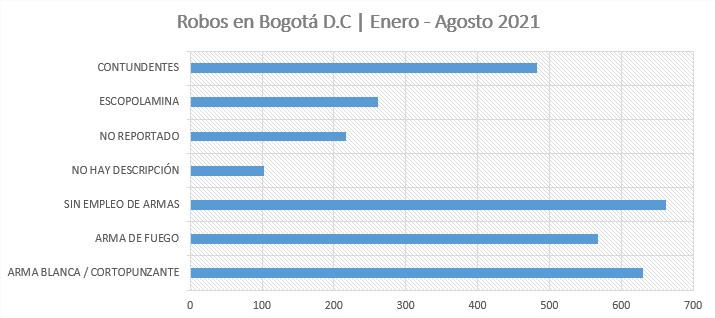
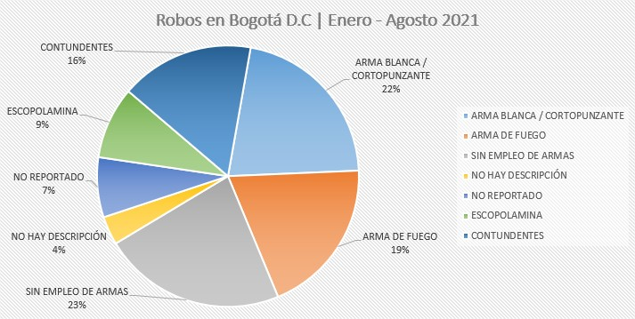
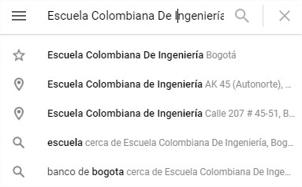
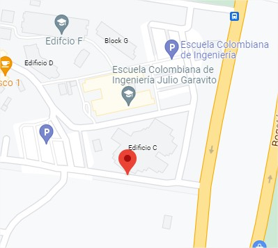
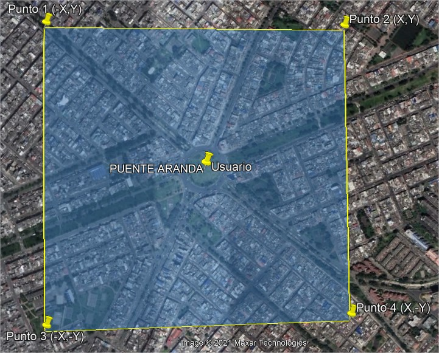

# SecurityInfo
 

## Autores
* Jose Maria Castro Ortega
* Daniel Santiago Ducuara Ardila
* Miguel Angel Rodriguez Siachoque
* James Alexander Duck Torres
* Andres Felipe Cubillos Hurtado
* Brayan Santiago Buitrago Murillo

## Problemática
En la ciudad de Bogotá se ha presentado un notable crecimiento en el número de robos, esto debido a diferentes factores. Uno de los factores más importantes es la falta de pie de fuerza por parte de las instituciones encargadas de la seguridad en el área distrital.   
 
 
> Estas graficas se realizando en base a los datos de la cantidad de robos con armas blancas, armas de fuego y sin ningún tipo de armas que fueron denunciados a ___La Policía Nacional de Colombia___ en la ciudad de ___Bogotá D.C.___, registrados hasta el 9 de septiembre de 2021. 
> [Archivo Fuente De Robos]( ArchivosReadme/Archivos/CifrasDeRobo.xlsx)  

Se puede notar la cantidad alarmante de robos, esto con base a la información notificada a ___La Policía Nacional de Colombia___, esto teniendo en cuenta que el 100% de los robos no son denunciados, incrementando la cantidad de robos en ___Bogotá D.C.___.   
El factor preocupante de la situación se encuentra que de los ___2924 robos___ en la ciudad, un gran porcentaje tiene complicaciones graves por la utilización de armas, ya que el ___22% fueron con armas blancas y 19% con armas de fuego___ con lo cual sería la peligrosidad critica de los robos sería del ___41%___. Esta cifra es preocupante y por esta razón es uno de los mayores problemas de la ciudad.

## Propuesta
Teniendo en cuenta el crecimiento en la cantidad de dispositivos inteligentes móviles en ___Bogotá D.C.___, que ha llegado a tal punto en que la gran mayoría de habitantes posee al menos uno de estos dispositivos y también la importancia que han tomado los planes de datos móviles y zonas wifi gratuitas con lo cual la mayoría de los dispositivos móviles tienen acceso a internet en cualquier instante.   
Con el fin de dar una solución a dicho problema que aqueja la ciudad, se plantea este aplicativo web y móvil. Así pudiendo dar una solución a la falta de pie de fuerza de las instituciones encargadas de la seguridad y dando más responsabilidad ciudadana a cada habitante de su zona.

### Objetivo
El objetivo de ___SecurityInfo___ es que cada habitante de su zona sea capaz de poder registrar y consultar los robos en donde se encuentra, esto con el fin de que el usuario conozca los peligros en los que se encuentra si la zona presenta una cantidad considerable de robos.

## Descripción
Teniendo en cuenta la problemática que se presenta y como nuestro aplicativo web y móvil genera una solución a esta, se puede explicar de una forma más técnica la organización de nuestro aplicativo, mostrando su arquitectura y herramientas utilizadas en el proceso de creación y mantenimiento de este.
### Funciones Principales
En términos generales la aplicación maneja dos conceptos importantes que hacen función constante en el aplicativo, los cuales son:
* **Consultar**   
Esta función es una de las más importantes, ya que es el incentivo que busca el usuario en nuestro aplicativo, ya que mediante este se podrá estar informando de los constantes peligros que puede presentar en la zona el usuario y así evitar estos.   
Por otro lado el usuario no solamente podrá consultar la información de la zona en el momento en que se encuentre en dicha área, también estando en otro sitio. Esto se hace con el fin de que nuestros usuarios tengan la posibilidad de poder conocer los posibles riesgos a los que se expondrá de camino a su sitio de destino.

* **Registrar**   
Esta función se puede considerar la más importante, ya que esta es la que nos otorgara la información de las zonas. Como anteriormente se mencionó la idea aparte de poder conocer las zonas críticas, también es dar un sentido de responsabilidad social a los habitantes.  
Al momento de registrar los robos se le pedirá al usuario tres componentes:
  * Lugar
  * Fecha y Hora
  * Breve descripción
  
Esto con el fin de generar un informe rápido y conciso para posteriormente ser mostrado en cuanto alguien realice alguna consulta en la zona. Cabe aclarar que dicho registro es anónimo, pues se hace con el fin de la seguridad del usuario, generando que no tenga ninguna preocupación en cuanto al momento de registrar se requiera.

### Geolocalización
Debido a la magnitud de terreno a cubrir el proyecto se desplegará para solo en área de la ciudad de ___Bogotá D.C.___, siendo una ciudad de alrededor ___8 millones de habitantes___ se entiende sus ___1775 km2___ de superficie. Por esta razón se considera que la aplicación de nuestro proyecto en esta ciudad es la ideal, ya que nos permite evaluar nuestro aplicativo en una ciudad con bastante terreno y una gran cantidad de robos diarios.
#### Método de localización
En este caso el método de localización se establecerá mediante coordenadas geográficas con lo cual se conformarán por ___latitudes y latitudes___. Con esto se establecerá dos métodos de búsqueda:   
* **Consulta por dirección**   
 
Esta consulta es la que realiza el usuario mediante el ingreso de una dirección o un sitio referente en la ciudad, esto con el fin de que los usuarios puedan hallar fácilmente la ubicación deseada.

* **Consulta grafica**   
 
Esta consulta es la que realiza el usuario mediante la visualización del mapa, para que el usuario pueda ubicar la zona de forma gráfica, esto se realiza para usuarios que no conozcan la dirección exacta del sitio.

#### Área de visualización
 
> Las coordenadas del punto 1 al 4, fueron generadas por el aplicativo, con base en la ubicación dada por el usuario, ya se la ubicación actual del usuario o una ubicación consultada por el mismo.
Como se puede apreciar en la imagen anterior, el usuario tendrá un monitoreo de alrededor de zona a una distancia de ___500 metros___ a la redonda, esta distancia se establece debido a las siguientes conclusiones:
* En ___Bogotá D.C.___ se maneja el concepto de cuadra que mide alrededor ___80 metros___.
* Una persona camina a una velocidad promedio de ___3 kilómetros por hora___.  

Con esto se puede establecer que el usuario podrá ver un el peligro alrededor de ___6 a 7 cuadras___ y con una diferencia entre los ___10 a 16 minutos___, esto con el fin de que el usuario tenga tiempo suficiente para reaccionar al peligro.

#### Notificación en la zona

## Diseño del Aplicativo

